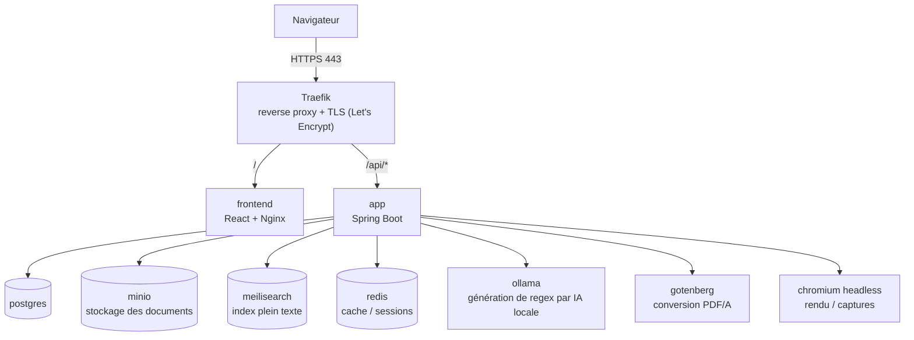

# MadeArchive

Système d'archivage électronique — conservation de documents avec preuve
d'intégrité (chiffrement, signature PKI, horodatage RFC 3161), extraction
automatique de métadonnées (OCR + IA locale), recherche plein texte, gestion
des droits par unité organisationnelle et cycle de vie complet des documents
(rétention, corbeille, purge).

## Sommaire

- [But de l'application](#but-de-lapplication)
- [Structure globale](#structure-globale)
- [Rôle de chaque conteneur](#rôle-de-chaque-conteneur)
- [Technologies utilisées](#technologies-utilisées)
- [Besoins matériel](#besoins-matériel-pour-un-fonctionnement-optimal)
- [Structure du dépôt](#structure-du-dépôt)
- [Déploiement](#déploiement)
- [Documentation complémentaire](#documentation-complémentaire)

---

## But de l'application

MadeArchive numérise et conserve des documents (factures, attestations,
pièces d'identité, contrats...) avec les garanties attendues d'un système
d'archivage électronique probant :

- **Intégrité prouvable** : chaque document est signé (PKI, clé propre à
  l'éditeur) et horodaté (RFC 3161) à l'archivage, puis vérifié
  périodiquement (contrôle de fixité automatisé).
- **Extraction automatique de métadonnées** : OCR (Tesseract) sur chaque
  document, puis génération de règles d'extraction par IA locale (Ollama)
  pour pré-remplir les champs des documents suivants du même type.
- **Recherche plein texte** sur l'intégralité du contenu OCRisé (Meilisearch).
- **Gestion fine des droits** : unités organisationnelles, groupes d'accès,
  documents/projets publics ou privés, journal d'audit complet.
- **Cycle de vie maîtrisé** : rétention configurable par type de document,
  corbeille avec délai de grâce, purge en "tombstone" (traçabilité même
  après suppression), jamais de perte silencieuse d'un enregistrement.

## Structure globale



| Couche | Rôle |
|---|---|
| **Frontend** (React) | Interface utilisateur — upload, recherche, administration, consultation. Ne parle jamais directement aux services de données : tout passe par `app`. |
| **Traefik** | Point d'entrée unique, HTTPS (certificats Let's Encrypt automatiques), route `/` vers le frontend et `/api/*` vers le backend. Seul service exposé publiquement (ports 80/443). |
| **app** (Spring Boot) | Toute la logique métier : upload, chiffrement, OCR, génération de regex, droits d'accès, audit, export, notifications. Seul composant qui parle aux services de données ci-dessous. |
| **postgres** | Base relationnelle — documents, métadonnées, utilisateurs, droits, journal d'audit. |
| **minio** | Stockage objet compatible S3 — fichiers PDF/A archivés (chiffrés). |
| **meilisearch** | Index de recherche plein texte sur le contenu OCRisé des documents. |
| **redis** | Cache et sessions. |
| **ollama** | Modèle de langage local (`qwen2.5-coder:14b`) — génère les règles d'extraction (regex) de métadonnées à partir du texte OCR, sans envoyer aucune donnée à un service externe. |
| **gotenberg** | Conversion de documents bureautiques vers PDF/A avant archivage. |
| **chromium** (headless) | Rendu de pages/captures pour certains imports et exports. |

## Rôle de chaque conteneur

Détail des 10 services déclarés dans `docker-compose.yml` :

| Service | Image | Exposition réseau |
|---|---|---|
| `traefik` | image "maison" (voir `traefik/Dockerfile`) | **Publique** — 80 et 443 uniquement |
| `frontend` | `madearchive-frontend` (build React → Nginx) | Interne (routé par Traefik) |
| `app` | `madearchive-app` (Spring Boot) | Interne (routé par Traefik) |
| `postgres` | `postgres:16-alpine` | Interne uniquement |
| `minio` | `minio/minio` | Interne uniquement |
| `meilisearch` | `getmeili/meilisearch` | Interne uniquement |
| `redis` | `redis:7-alpine` | Interne uniquement |
| `ollama` | `ollama/ollama` | Interne uniquement |
| `gotenberg` | `gotenberg/gotenberg:8` | Interne uniquement |
| `chromium` | `ghcr.io/browserless/chromium` | Interne uniquement |

**Aucun service autre que `traefik` ne doit jamais être exposé publiquement**
— voir `DEPLOYMENT.md` section 5 pour la vérification à faire avant un vrai
déploiement.

## Technologies utilisées

**Backend**
- Java 17, Spring Boot 4.0.6, Gradle
- PostgreSQL (données), Redis (cache)
- Tesseract OCR + Apache PDFBox (extraction de texte/position)
- Ollama + `qwen2.5-coder:14b` (génération de règles d'extraction par IA locale)
- Signature PKI (keystore PKCS12) + horodatage RFC 3161

**Frontend**
- React 19, TypeScript, Vite

**Infrastructure**
- Docker Compose (déploiement de référence)
- Traefik (reverse proxy, TLS automatique)
- MinIO (stockage objet), Meilisearch (recherche plein texte)
- Gotenberg (conversion PDF/A), Chromium headless

**Autres**
- Un smart contract Solidity (`Backend/archive/Blockchain/DocumentRegistry.sol`)
  pour un ancrage optionnel des preuves d'intégrité.
- Charts Helm (`Backend/archive/deploy/helm/`) pour un déploiement Kubernetes
  alternatif — non couvert par ce README, qui documente le déploiement
  Docker Compose (le chemin de référence).

## Besoins matériel pour un fonctionnement optimal

| Ressource | Minimum viable | Recommandé |
|---|---|---|
| RAM | 8 Go | **16 Go+** |
| CPU | 4 cœurs | 8 cœurs+ |
| Disque | 30 Go | 60 Go+ (dépend du volume de documents archivés) |

`ollama` avec `qwen2.5-coder:14b` consomme à lui seul ~10 Go de RAM une fois
le modèle chargé (mesuré empiriquement, seuil réel entre 9 et 10 Go). Avec le
reste de la pile (Postgres, MinIO, Meilisearch, Redis, Gotenberg, Chromium,
l'application elle-même), un serveur à 4-8 Go est insuffisant — voir
`docker-compose.yml` pour les `mem_limit`/`cpus` fixés par service.

## Structure du dépôt

```
MadeArchive/
├── Backend/archive/                    # Backend Spring Boot
│   ├── src/main/java/made/archive/
│   │   ├── controller/                 # Points d'entrée HTTP (REST)
│   │   ├── service/                    # Logique métier (document, auth, organisation, notification...)
│   │   ├── entite/                     # Entités JPA (Document, User, TypeDocument, Retention...)
│   │   ├── repository/                 # Accès base de données (Spring Data JPA)
│   │   ├── dto/                        # Objets de transfert (requêtes/réponses API)
│   │   ├── security/                   # Auth JWT, filtres, chiffrement
│   │   ├── config/                     # Configuration Spring + tâches planifiées (schedulers)
│   │   ├── factory/ · exception/ · util/
│   ├── src/test/java/                  # Tests unitaires
│   ├── traefik/                        # Dockerfile + template de config Traefik
│   ├── deploy/helm/                    # Charts Kubernetes (alternative à Docker Compose)
│   ├── Blockchain/                     # Smart contract Solidity (ancrage optionnel)
│   ├── hsm/                            # Keystore PKCS12 (clés de signature PKI)
│   ├── docker-compose.yml              # Déploiement de référence (10 services)
│   ├── .env.example                    # Modèle de configuration — copier en .env
│   ├── DEPLOYMENT.md                   # Guide de déploiement détaillé
│   └── build.gradle
│
├── Frontend/                           # Interface React
│   ├── src/
│   │   ├── Admin/ · User/ · Editor/    # Écrans par rôle
│   │   ├── document/                   # Upload, consultation, recherche
│   │   ├── organisation/               # Unités organisationnelles, groupes d'accès
│   │   ├── auth/ · services/ · hooks/  # Authentification, appels API, hooks partagés
│   │   ├── Style/                      # Feuilles de style
│   │   └── components/
│   ├── Dockerfile                      # Build multi-étapes (Node → Nginx)
│   └── package.json
│
├── docs/                                # Documentation projet (mémoire, schémas)
└── .github/workflows/                   # CI (tests) + publication des images (ghcr.io)
```

## Déploiement

Structure squelettique du processus — le détail complet (avec toutes les
commandes) est dans `Backend/archive/DEPLOYMENT.md` ; voici l'enchaînement :

```
1. Prérequis        → VPS Linux, Docker + Docker Compose, domaine avec DNS A,
                       ports 80/443 ouverts
2. Récupérer        → git clone https://github.com/Lloyd-koutele/MadeArchive.git
3. Configurer .env  → cp .env.example .env  (voir ci-dessous pour l'emplacement)
4. Domaine          → une seule variable à éditer dans .env
5. Sécurité         → vérifier qu'aucun service interne n'est publié (section 5, DEPLOYMENT.md)
6. Démarrer         → docker compose up -d --build
7. Admin            → créer le premier compte administrateur
8. Vérifier         → contrôles post-déploiement (DEPLOYMENT.md section 8)
9. Mettre à jour    → tag Git de version → publication auto (ghcr.io) → docker compose pull && up -d
```

### Configurer le nom de domaine

Une seule valeur à renseigner, dans `.env` :

```bash
APP_DOMAIN=votre-domaine.com
```

Elle est lue à la fois par le backend (CORS, lien du QR code d'attestation)
et par Traefik, qui régénère automatiquement sa configuration de routage
(`traefik/dynamic.yml`) à partir de ce nom de domaine à chaque démarrage —
rien d'autre à modifier manuellement, ni côté Traefik ni côté frontend.

### Exemple de `docker-compose.yml`

Extrait représentatif (le fichier complet, 10 services, vit dans
[`Backend/archive/docker-compose.yml`](Backend/archive/docker-compose.yml)) :

```yaml
services:
  postgres:
    image: postgres:16-alpine
    container_name: postgres
    ports:
      - "127.0.0.1:5433:5432"   # port hôte différent de 5432 pour ne pas entrer
                                 # en conflit avec un Postgres local déjà installé —
                                 # sans impact sur "app", qui parle à postgres:5432
                                 # sur le réseau Docker interne, jamais via ce port.
    environment:
      POSTGRES_USER: ${DB_USERNAME}
      POSTGRES_PASSWORD: ${DB_PASSWORD}
      POSTGRES_DB: madearchive
    volumes:
      - postgres_data:/var/lib/postgresql/data   # volume nommé : survit à un
                                                   # "docker compose down" sans -v
    healthcheck:
      test: ["CMD-SHELL", "pg_isready -U ${DB_USERNAME}"]
      interval: 10s
      timeout: 5s
      retries: 5

  frontend:
    image: ghcr.io/lloyd-koutele/madearchive-frontend:latest
    container_name: madearchive-frontend
    # Pas de port publié : uniquement joignable via Traefik.

  app:
    image: ghcr.io/lloyd-koutele/madearchive-app:latest
    container_name: madearchive-app
    env_file:
      - .env                    # toutes les variables "À CHANGER" de .env
    depends_on:
      postgres: { condition: service_healthy }
      minio: { condition: service_healthy }
      meilisearch: { condition: service_healthy }
      ollama: { condition: service_healthy }
    environment:
      # Ces valeurs SURCHARGENT .env : à l'intérieur des conteneurs, les
      # services se joignent par leur NOM Docker ("postgres", "minio"...),
      # jamais par "localhost" (qui désignerait le conteneur lui-même).
      DB_URL: jdbc:postgresql://postgres:5432/madearchive
      OLLAMA_BASE_URL: http://ollama:11434
      MINIO_URL: http://minio:9000
      MEILISEARCH_HOST: http://meilisearch:7700
    volumes:
      - hsm_data:/app/hsm       # clés de signature PKI : doit survivre aux redéploiements

volumes:
  postgres_data:
  ollama_data:
  hsm_data:
  traefik_certs:
```

### Exemple de `.env`

Modèle complet dans [`Backend/archive/.env.example`](Backend/archive/.env.example) —
extrait des variables à changer obligatoirement :

```bash
# À CHANGER
APP_DOMAIN=votredomaine.com
ACME_EMAIL=vous@votredomaine.com

DB_USERNAME=postgres
DB_PASSWORD=CHANGE_MOI                    # openssl rand -base64 32

JWT_SECRET=CHANGE_MOI                     # openssl rand -base64 48

MINIO_ACCESS_KEY=CHANGE_MOI
MINIO_SECRET_KEY=CHANGE_MOI

MEILI_MASTER_KEY=CHANGE_MOI               # openssl rand -base64 32

CHROMIUM_TOKEN=CHANGE_MOI                 # openssl rand -hex 24

HSM_KEYSTORE_PASSWORD=CHANGE_MOI          # openssl rand -base64 32

# DOIT faire exactement 32 octets une fois décodée en Base64
STORAGE_ENCRYPTION_KEY=CHANGE_MOI         # openssl rand -base64 32
```

Toutes les autres variables (`DB_URL`, `OLLAMA_BASE_URL`, `MINIO_URL`,
`MEILISEARCH_HOST`...) sont déjà correctes pour un usage Docker — elles ne
servent de repère que pour un lancement natif hors conteneur, et sont de
toute façon surchargées par `docker-compose.yml` (voir l'exemple ci-dessus).

### Exemple de `Dockerfile` (backend)

[`Backend/archive/Dockerfile`](Backend/archive/Dockerfile) — attend un `.jar`
déjà compilé (`./gradlew bootJar`), pas de build multi-étapes ici (à la
différence du frontend) :

```dockerfile
FROM eclipse-temurin:17-jdk-jammy
WORKDIR /app

# Tesseract + langues (fra/eng/ara) — la conversion PDF, elle, passe par le
# conteneur Gotenberg séparé (voir docker-compose.yml), pas par cette image.
RUN apt-get update && apt-get install -y \
    tesseract-ocr \
    tesseract-ocr-fra \
    tesseract-ocr-eng \
    tesseract-ocr-ara \
    fonts-liberation \
    fonts-dejavu \
    && rm -rf /var/lib/apt/lists/* \
    && tesseract --version

COPY build/libs/*.jar app.jar
EXPOSE 8080
ENTRYPOINT ["java", "-jar", "app.jar"]
```

### Exemple de `Dockerfile` (frontend)

[`Frontend/Dockerfile`](Frontend/Dockerfile) — build multi-étapes : Node
compile les assets statiques, Nginx les sert (jamais le serveur de dev Vite
en production) :

```dockerfile
FROM node:22-alpine AS build
WORKDIR /app
COPY package*.json ./
RUN npm ci
COPY . .

# Gravé dans le bundle JS au moment du build (Vite ne lit jamais de variable
# d'environnement au runtime) — /api en relatif fonctionne quel que soit le
# domaine réel, tant que Traefik route /api/* vers "app".
ARG VITE_API_URL=/api
ENV VITE_API_URL=${VITE_API_URL}
RUN npm run build:docker

FROM nginx:1.27-alpine
COPY --from=build /app/dist /usr/share/nginx/html
COPY nginx.conf /etc/nginx/conf.d/default.conf
EXPOSE 80
```

> `node:22` (pas 20) : deux dépendances (`pdfjs-dist`, `react-router`)
> exigent Node ≥22 — sous Node 20, le build `arm64` (émulation QEMU du
> pipeline CI) plantait avec `qemu: uncaught target signal 4 (Illegal
> instruction)`. Voir le commentaire du fichier pour le détail.

### Configuration Nginx (frontend)

Le frontend est servi par Nginx (image de production, jamais le serveur de
dev Vite) — configuration complète dans
[`Frontend/nginx.conf`](Frontend/nginx.conf) :

```nginx
server {
    listen 80;
    server_name _;
    root /usr/share/nginx/html;
    index index.html;

    # SPA React Router : toute route inconnue retombe sur index.html, sinon
    # un rafraîchissement sur /documents/123 renverrait un 404 Nginx au lieu
    # de laisser le routeur côté client décider.
    location / {
        try_files $uri $uri/ /index.html;
    }

    # Fichiers versionnés par Vite (hash dans le nom) : cache long sans
    # risque, un déploiement change le nom de fichier, jamais son contenu.
    location /assets/ {
        expires 1y;
        add_header Cache-Control "public, immutable";
    }

    # .mjs explicitement en JavaScript : sans ça, un Worker module (rendu PDF)
    # refuse de démarrer, faute de type MIME correct.
    location ~* \.mjs$ {
        default_type application/javascript;
        expires 1y;
        add_header Cache-Control "public, immutable";
    }
}
```

### Structure squelettique avant `docker compose up -d`

Juste avant de lancer la commande, le dossier `Backend/archive/` (ou le
dossier de déploiement choisi) doit ressembler à ceci :

```
Backend/archive/
├── docker-compose.yml       # tel quel, cloné depuis le dépôt
├── .env                     # créé à partir de .env.example, toutes les
│                            # valeurs "À CHANGER" remplacées, chmod 600
├── hsm/
│   └── editors-keystore.p12 # keystore PKI — généré au premier lancement
│                            # s'il n'existe pas encore
└── traefik/
    ├── Dockerfile
    └── dynamic.yml.template # régénère traefik/dynamic.yml automatiquement
                              # à partir de APP_DOMAIN (.env) à chaque démarrage
```

Rien d'autre n'est requis manuellement : `frontend` et `app` sont des images
déjà construites et publiées (`ghcr.io/lloyd-koutele/...`), pas du code
source à compiler sur place. Une fois cette structure en place :

```bash
docker compose up -d
```

### Où placer le fichier `.env` par rapport à `docker-compose.yml`

Par défaut, **`.env` doit être dans le même dossier que `docker-compose.yml`**
(`Backend/archive/`) — c'est là que `docker compose` le cherche
automatiquement, sans configuration supplémentaire :

```bash
cd Backend/archive
cp .env.example .env
nano .env          # remplacer toutes les valeurs marquées "À CHANGER"
chmod 600 .env      # lecture/écriture réservée au seul utilisateur de déploiement
```

**Pour un VPS en production**, il est recommandé d'aller plus loin et de
sortir `.env` du dossier du dépôt cloné (plus largement accessible en
pratique — déploiements automatisés, accès SFTP...) vers un chemin dédié,
verrouillé :

```bash
sudo mkdir -p /etc/madearchive
sudo mv Backend/archive/.env /etc/madearchive/.env
sudo chmod 700 /etc/madearchive
sudo chown deploy:deploy /etc/madearchive/.env
sudo chmod 600 /etc/madearchive/.env

# Puis, à chaque démarrage, pointer explicitement dessus :
docker compose --env-file /etc/madearchive/.env up -d
```

Ne jamais commiter `.env` dans git (`.env.example` seul est versionné —
déjà garanti par `.gitignore`), ne jamais le placer dans un chemin servi par
le frontend/Traefik.

## Documentation complémentaire

- [`Backend/archive/DEPLOYMENT.md`](Backend/archive/DEPLOYMENT.md) — guide de déploiement pas à pas (prérequis, sécurité, mise à jour, dépannage).
- [`Backend/archive/deploy/helm/README.md`](Backend/archive/deploy/helm/README.md) — déploiement Kubernetes alternatif.
- `docs/` — documentation projet complémentaire.
